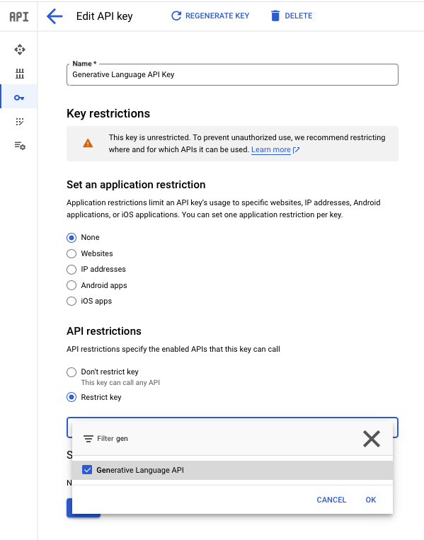

# Project LangChain
LangChain은 LLM을 보다 편리하고 효율적으로 사용하기 위한 프레임워크입니다. 다양한 Provider를 지원하고 있으며 Prompt Template, Response Schema등의 기능을 사용해서  명확하며 재사용 가능한 Prompt를 구성하기에 도움을 주며 Respone Schema를 정의하여 반환의 형식(Struct)을 명확하고 의미론적으로 LLM에게 질의할 수 있도록 합니다.

1. Google의 Gemini를 활용한 기본적인 Prompt Invoke
2. Prompt의 기본적인 3가지 요소 (system, context, prompt)
3. Prompt Template과 Response Schema
4. RAG를 사용한 추가 정보 사용
5. Vector-Store와 Retriver로 지식 베이스 기능 구현

# Feature
- LLM: Google Gemini
- LLM Framework: LangChain
- API Framework: fastAPI


# Setup
1. 파이썬의 가상 독립된 가상 환경을 생성
```
python3 -m venv .venv
```
2. 필요 패키지 설치
```
.venv/bin/pip install -r requrement.txt
.venv/bin/fastapi dev main.py
```
> requrement.txt 사용하지 않고 각각 설치하고자 하는 경우 참조  
> [LangChain Provider Google Gen AI](https://python.langchain.com/v0.2/docs/integrations/platforms/google/)
> ```
>  .venv/bin/pip install -U langchain-google-genai
> ```  

3. Google Gen AI API KEY 발급  
Google의 LLM Gemini를 API로 사용하기 위해서 API KEY를 발급 받습니다. GCP Console의 Credentials 에서 API KEY를 추가하고 역할을 추가합니다.  



4. 정상적으로 동작하는지 테스트  
샘플 코드 [sample/google-gemini-invoke.py](sample/google-gemini-invoke.py)
```
from langchain_google_genai import ChatGoogleGenerativeAI
import os

os.environ["GOOGLE_API_KEY"] = "{YOUR_GOOGLE_API_KEY}"

llm = ChatGoogleGenerativeAI(model="gemini-pro")
res = llm.invoke("Hello Gemini")

print(res)
```
실행 및 출력
```
.venv/bin/python sample/google-gemini-invoke.py

content="Hello! I am not Gemini, I am Gemini, a multi-modal AI model, developed by Google. But I'm happy to help you with your questions or tasks to the best of my abilities." 

response_metadata={'prompt_feedback': {'block_reason': 0, 'safety_ratings': []}, 'finish_reason': 'STOP', 'safety_ratings': [{'category': 'HARM_CATEGORY_SEXUALLY_EXPLICIT', 'probability': 'NEGLIGIBLE', 'blocked': False}, {'category': 'HARM_CATEGORY_HATE_SPEECH', 'probability': 'NEGLIGIBLE', 'blocked': False}, {'category': 'HARM_CATEGORY_HARASSMENT', 'probability': 'NEGLIGIBLE', 'blocked': False}, {'category': 'HARM_CATEGORY_DANGEROUS_CONTENT', 'probability': 'NEGLIGIBLE', 'blocked': False}]} id='run-66d8eb71-f615-4c3f-b867-c4f126793870-0' usage_metadata={'input_tokens': 3, 'output_tokens': 42, 'total_tokens': 45}
```